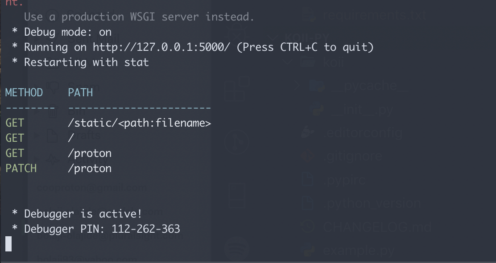

# KOII

[](https://github.com/ellerbrock/open-source-badge/)
[](https://github.com/ellerbrock/open-source-badge/)

Python module for displaying routes in a flask application. This is a python variant for [Koii](https://github.com/BolajiOlajide/koii). It's a simple to use flask middleware that simply prints all the routes in a Flask application on the console.

## Installation

Koii is easy to install - it currently can be installed using the `pip` or `pipenv` command.

```sh
pip install koii
```

```sh
pipenv install koii
```

### Usage

To make use of Koii, ensure you initialize the middleware by passing the instance of your flaks app into the class or the `init_app` method. Ensure the class is initialized after your routes have been defined. If you're making use of blueprints, the same also applies, place the initialisation of the class after your blueprint registration.

```py
from koii import Koii

app = Flask(__name__)

Koii(app)
```

alternatively, you can make use of the `init_app` method available after instantiating the Koii class.

```py
from flask import Flask
from flask_cors import CORS
from flask_sqlalchemy import SQLAlchemy
from koii import Koii

from config import config

db = SQLAlchemy()
koii = Koii()

def create_app(config_name):
    """
    Initialize the application after runtime.
    This is done to enable the use of Blueprint.
    """
    app = Flask(__name__)
    app.config.from_object(config[config_name])
    db.init_app(app)
    app.config['CORS_HEADERS'] = 'Content-Type'
    cors = CORS(app)

    # Register the authentication blueprint in the application instance.
    from auth import authentication as auth_blueprint
    app.register_blueprint(auth_blueprint, url_prefix='/auth')

    # Link to the blueprint script for the routes
    from main import main as main_blueprint
    app.register_blueprint(main_blueprint, url_prefix='/api/v1')

    koii.init_app(app)

    return app
```

An example file can be [found here](https://github.com/BolajiOlajide/koii-py/blob/master/example.py).



[](https://www.patreon.com/bePatron?u=14962348)
